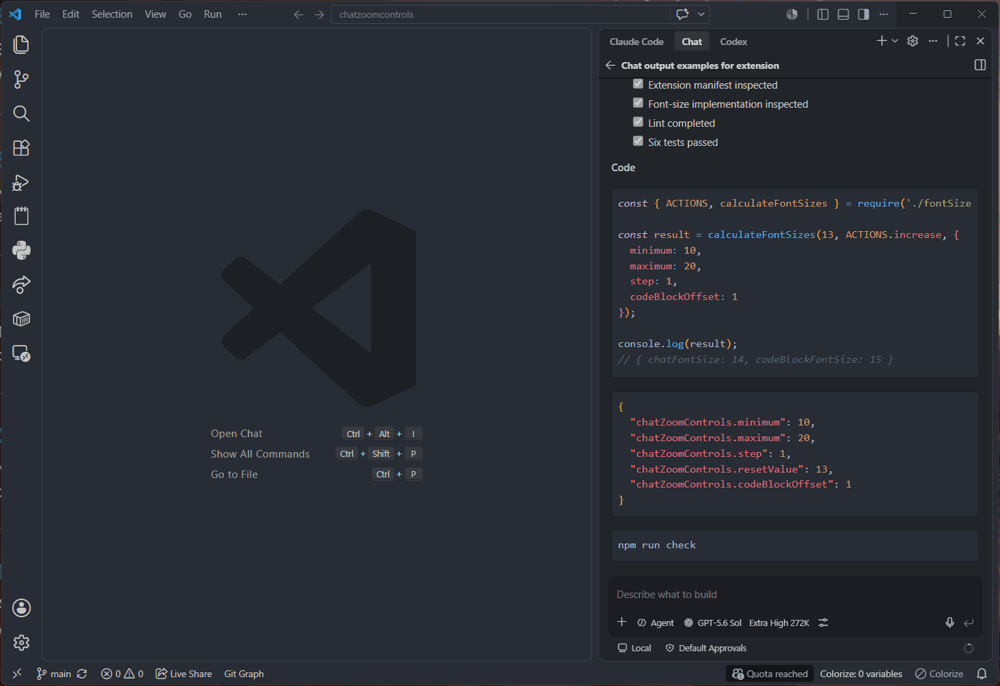

# Chat Zoom Controls

Quickly increase, decrease, or reset the zoom level used by AI chat views in Visual Studio Code. The extension adjusts the font sizes of regular Markdown responses and code blocks together while keeping them synchronized.

It uses the built-in `chat.fontSize` and `chat.editor.fontSize` settings, so it works with VS Code chat experiences that honor those settings, including GitHub Copilot Chat and compatible AI chat extensions.



## Features

- Increase or decrease from the current effective chat font size.
- Use hard minimum and maximum limits instead of wrapping around.
- Keep code blocks at a configurable offset from regular chat text.
- Reset both font sizes with one command.
- Handle rapid repeated key presses in order.
- Show the applied values briefly in the status bar.
- Configure the step, limits, reset value, and code block offset.

## Default shortcuts

| Action | Windows/Linux | macOS |
| --- | --- | --- |
| Increase | `Ctrl+Alt+Numpad +` | `Cmd+Alt+Numpad +` |
| Decrease | `Ctrl+Alt+Numpad -` | `Cmd+Alt+Numpad -` |
| Reset | `Ctrl+Alt+Numpad *` | `Cmd+Alt+Numpad *` |

The commands are also available from the Command Palette under **Chat Zoom**. You can replace the default shortcuts in **Preferences: Open Keyboard Shortcuts**.

## Defaults

The initial configuration reproduces VS Code's usual one-pixel relationship between chat text and chat code blocks:

- Minimum chat size: `10`
- Maximum chat size: `20`
- Step: `1`
- Reset chat size: `13`
- Code block offset: `1` (reset code block size: `14`)

## Settings

| Setting | Default | Description |
| --- | ---: | --- |
| `chatZoomControls.minimum` | `10` | Hard lower limit for chat Markdown text. |
| `chatZoomControls.maximum` | `20` | Hard upper limit for chat Markdown text. |
| `chatZoomControls.step` | `1` | Amount added or subtracted per command. |
| `chatZoomControls.resetValue` | `13` | Chat Markdown size used by Reset. |
| `chatZoomControls.codeBlockOffset` | `1` | Amount added to the chat size for code blocks. |

Example:

```json
{
   "chatZoomControls.minimum": 11,
   "chatZoomControls.maximum": 18,
   "chatZoomControls.step": 0.5,
   "chatZoomControls.resetValue": 13,
   "chatZoomControls.codeBlockOffset": 1
}
```

## Installation

### Visual Studio Marketplace

Install [Chat Zoom Controls](https://marketplace.visualstudio.com/items?itemName=goohan.chatzoomcontrols) from the Extensions view in VS Code or run:

```powershell
code --install-extension goohan.chatzoomcontrols
```

### Install a packaged VSIX

Download a `.vsix` file from the repository releases and run:

```powershell
code --install-extension .\chatzoomcontrols-<version>.vsix
```

Then run **Developer: Reload Window** if VS Code asks you to reload.

### Simple source installation

The extension has no runtime dependencies or build step. Download or clone this repository, then copy its contents to a folder such as:

```text
Windows: %USERPROFILE%\.vscode\extensions\goohan.chatzoomcontrols-<version>
macOS/Linux: ~/.vscode/extensions/goohan.chatzoomcontrols-<version>
```

Make sure `package.json` and `extension.js` are directly inside that folder, then run **Developer: Reload Window**.

## Development

Requirements:

- Visual Studio Code 1.100 or newer
- Node.js 20 or newer

Install development dependencies and validate the extension:

```powershell
npm install
npm run check
npm run package
```

Press `F5` in VS Code to launch an Extension Development Host. Use the three **Chat Zoom** commands there to test changes.

## How it works

Each command reads the current effective `chat.fontSize`, calculates the next clamped value, and updates both:

- `chat.fontSize`
- `chat.editor.fontSize`

Updates are queued inside the VS Code extension host. This avoids spawning a terminal process and prevents rapid key presses from reading stale values.

## Known limitations

- VS Code does not currently expose chat-specific mouse-wheel zoom, so this extension provides commands and keyboard shortcuts instead.
- A chat extension must honor VS Code's `chat.fontSize` or `chat.editor.fontSize` settings for the change to be visible.

## Alternative and historical approaches

See [Métodos alternativos e históricos](docs/metodos-alternativos.md) for a Spanish-language guide to the earlier Settings Cycler and PowerShell solutions, including their tradeoffs and complete configuration examples.

## License

[MIT](LICENSE.md)

## Credits

The icon for this extension is based on the Flaticon library: [Zoom icons created by Magnific - Flaticon](https://www.flaticon.com/free-icons/zoom)
